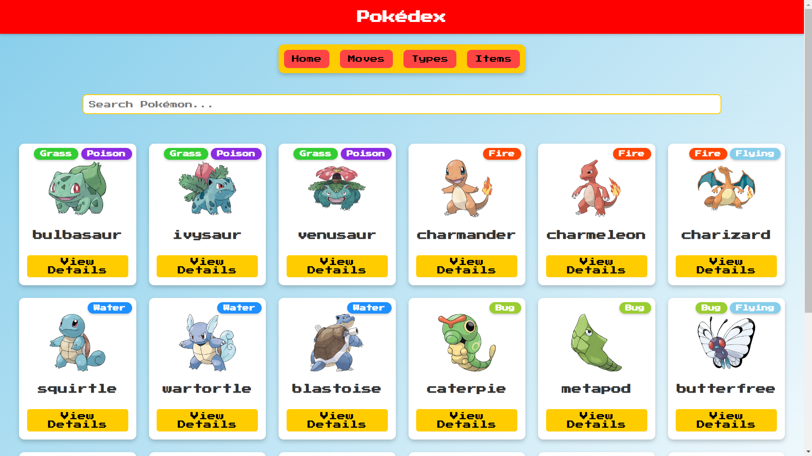
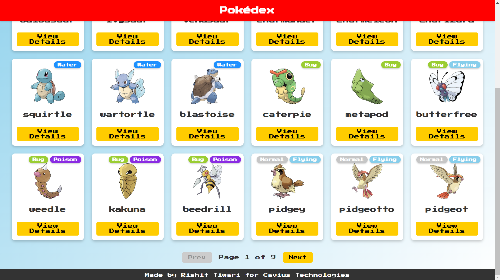
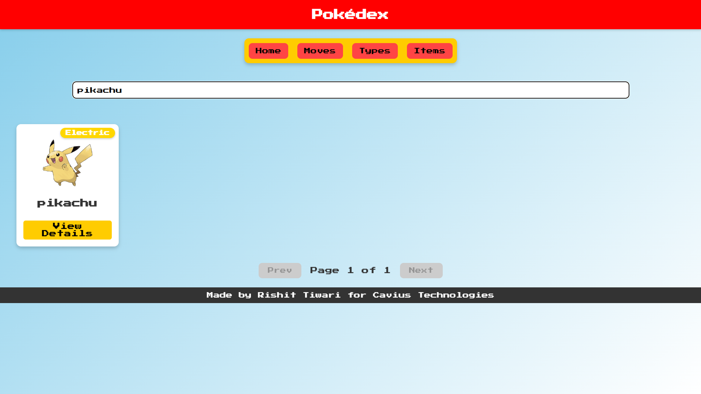
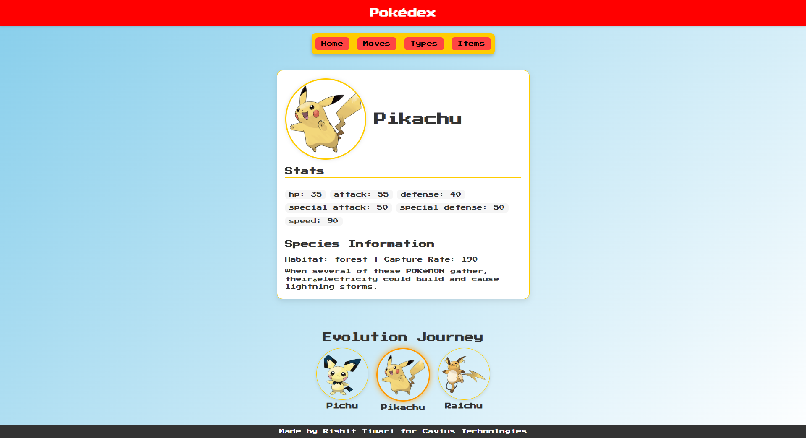
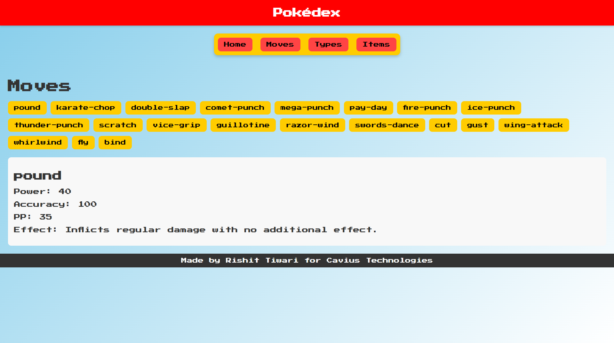
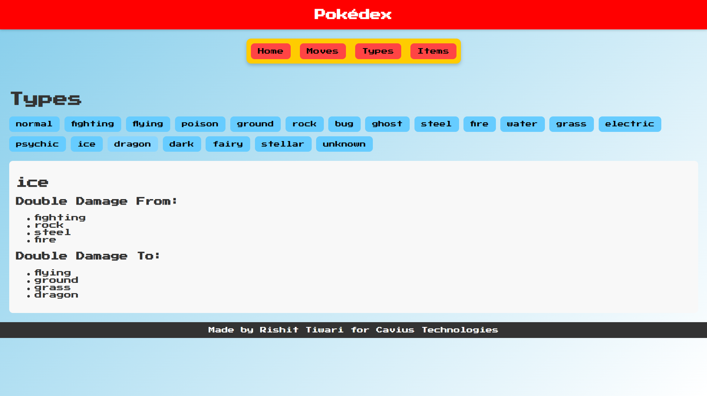
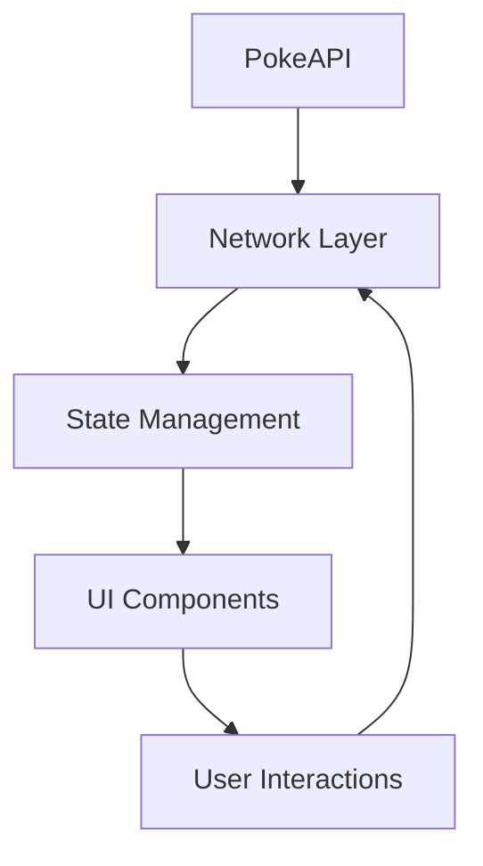
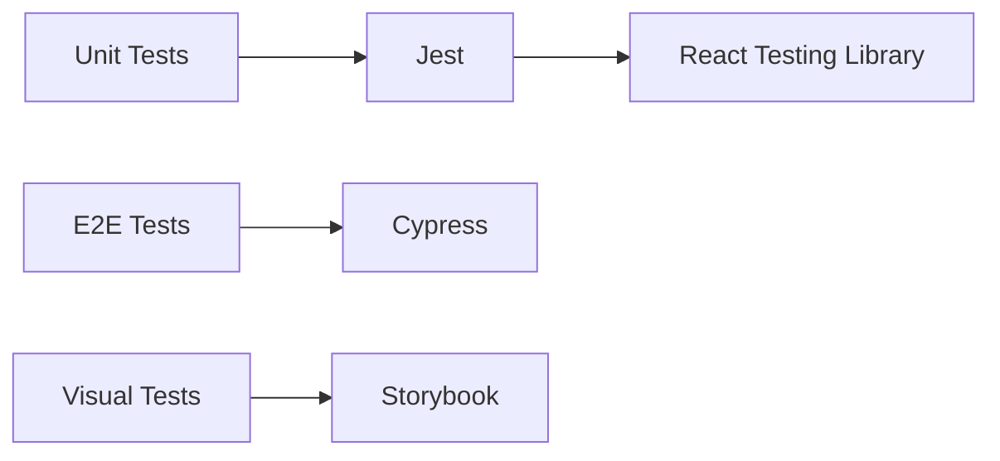

# 🎮  Pokédex - Cavius Technologies

<div align="center">
  <div style="display: flex; justify-content: center; gap: 20px;">
  
  
  
</div>

</div>

## 📸 Screenshots

<table>
  <tr>
    <td align="center">
      <br/>
      <sub>Explore diverse Pokémon types with our intuitive grid layout featuring sprite animations and type indicators</sub>
    </td>
    <td align="center">
      <br/>
      <sub>Navigate through generations with our smooth pagination system - 151 Pokémon per page</sub>
    </td>
  </tr>
  <tr>
    <td align="center">
      <br/>
      <sub>Advanced search with multiple filters: type, generation, stats, and abilities</sub>
    </td>
    <td align="center">
      <br/>
      <sub>Comprehensive Pokémon profile with stats, moves, types, and collectible items</sub>
    </td>
  </tr>
  <tr>
    <td align="center">
      <br/>
      <sub>Browse all move categories: Physical, Special, Status - with detailed filtering by type, power, and effects</sub>
    </td>
    <td align="center">
      <br/>
      <sub>Complete type catalog showcasing all 18 Pokémon types, dual-type combinations, and type matchups</sub>
    </td>
  </tr>
</table>

## 🌟 Target Audience

Our project caters to three primary user groups:

1. **Pokémon Enthusiasts** - Casual users exploring Pokémon data
2. **Frontend Developers** - Learning React/TypeScript best practices
3. **Open Source Contributors** - Looking to enhance a real-world project

## 🧩 Core System Architecture



## 🛠️ Technology Stack

### Core Foundation

| Technology  | Purpose                        | Version |
|------------|--------------------------------|---------|
| React      | Component-based UI Architecture| 18.2    |
| TypeScript | Type Safety & Code Quality     | 4.9     |
| Vite       | Ultra-Fast Build Tooling       | 4.0     |
| React Router| Client-Side Navigation        | 6.8     |

### Advanced Features

- **Parallel Data Fetching**: Promise.all() for concurrent API requests
- **Memoization**: React.memo for performance optimization
- **Error Boundaries**: Graceful error handling (WIP)

## 📂 Project Structure

```
src/
├── components/       # Atomic Design Principles
│   ├── PokemonCard.tsx  # Card UI with hover effects
│   ├── TypeBadge.tsx    # Dynamic type styling
│   └── Navbar.tsx       # Responsive navigation
├── pages/
│   ├── Home.tsx         # Grid layout with search
│   └── PokemonDetails.tsx # Deep dive view
├── services/
│   └── pokeapi.ts       # API abstraction layer
├── types/
│   └── pokemon.d.ts     # TypeScript interfaces
└── assets/
    └── styles/          # CSS Modular Architecture
```

## 🔍 Key Components

### 1. PokemonCard Component

**Purpose**: Display Pokémon thumbnail information

**Tech Highlights**:
- Prop Types Validation
- Responsive image loading
- Dynamic type coloring

```typescript
interface PokemonCardProps {
  id: number;
  name: string;
  types: PokemonType[];
  sprite: string;
}

const PokemonCard: FC<PokemonCardProps> = ({ id, name, types, sprite }) => {
  // Component implementation
}
```

### 2. API Service Layer

**Design Rationale**: Centralized API calls with error handling wrapper

```typescript
export const fetchPokemonDetails = async (id: string): Promise<Pokemon> => {
  try {
    const response = await fetch(`https://pokeapi.co/api/v2/pokemon/${id}`);
    if (!response.ok) throw new Error('API Error');
    return await response.json();
  } catch (error) {
    console.error('Fetch error:', error);
    throw error;
  }
};
```

### 3. Type System Design

**Why Interfaces?** Strong typing for API responses and component contracts

```typescript
interface Pokemon {
  id: number;
  name: string;
  types: Array<{
    slot: number;
    type: {
      name: PokemonType;
      url: string;
    };
  }>;
  // ...15+ additional fields
}
```

## 🚀 Performance Optimizations

### Batch Fetching

```typescript
// Home.tsx - Fetch first 151 Pokémon
const loadPokemon = async () => {
  const list = await fetchPokemonList(151);
  const details = await Promise.all(
    list.map(p => fetchPokemonDetails(p.name))
  );
  setPokemonList(details);
};
```

### CSS Optimization Strategy
- Minimal global styles
- Component-scoped CSS
- Hardware-accelerated animations
- Responsive grid layout

## 📈 API Design Decisions

### Why PokeAPI?
- Comprehensive Pokémon data
- Free & open API
- Well-maintained documentation
- Community support

### Rate Limiting Strategy
- Client-side caching (localStorage)
- Request throttling
- Error retry mechanism (WIP)

## 🧪 Testing Strategy



## 🚧 Development Setup

### Environment Requirements
- Node.js 16+
- npm 8+
- Modern browser (Chrome 100+ recommended)

### Build Process

```bash
# Install dependencies
npm install

# Start dev server
npm run dev

# Production build
npm run build

# Preview build
npm run preview
```

<div align="center">
  <h3>Connect with Me</h3>
  <p>
    <a href="https://github.com/rixitgithub">GitHub</a> •
    <a href="https://linkedin.com/in/rishit_tiwari">LinkedIn</a> •
    <a href="mailto:irishittiwari@gmail.com">Email</a>
  </p>
  <sub>🔬 Built by Rishit Tiwari for Cavius Technologies</sub>
</div>
